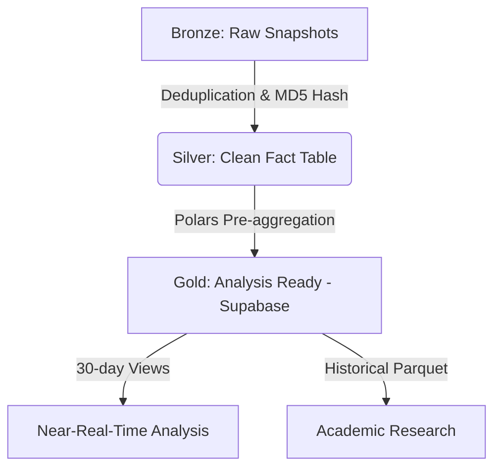
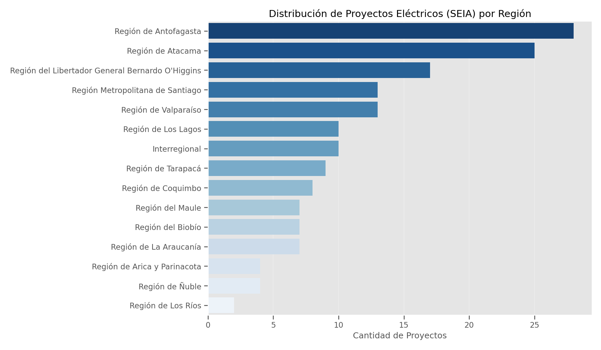

# Technical Chronicle: Anatomy of a Research Infrastructure

This document narrates the technical evolution of the project, from a near-real-time monitor to a high-performance data infrastructure for academic research.

## 📜 Table of Contents
1. [The Origin: The IP Wall](#1-the-origin-the-ip-wall)
2. [The Pivot: Local-First and Asynchrony](#2-the-pivot-local-first-and-asynchrony)
3. [Medallion Architecture: From Chaos to Gold](#3-medallion-architecture-from-chaos-to-gold)
4. [Data Transparency and EDA](#4-data-transparency-and-eda)
5. [Customer Estimation Methodology](#5-customer-estimation-methodology)

---

## 1. The Legacy: Near-Real-Time Architecture (2017-2024)

This section documents the original continuous monitoring architecture, designed to operate 24/7 before pivoting towards historical research. Although much of this code now lives in `scripts/legacy/`, its design patterns were fundamental to understanding the nature of the data.

### 1.1 High Availability & Resilience Design
The goal was to maintain a constant "heartbeat" of the electrical system. To achieve this in a hostile environment (IP blocks, timeouts), we implemented robust stability patterns.

#### 🛡️ Circuit Breaker Pattern
To avoid overwhelming the source server and prevent brute-force IP blocks, we implemented a **Circuit Breaker** (`core/circuit_breaker.py`).
- **Logic**: If the scraper detected 5 consecutive failures (HTTP 500/503 or DOM changes), the circuit would "trip" (open).
- **Effect**: The system would enter a "Cooldown" standby mode for 30 minutes, rejecting any new scraping attempts until the source stabilized.
- **Evidence**: Unit tests in `tests/unit/test_circuit_breaker.py` validate these state transitions (CLOSED -> OPEN -> HALF-OPEN).

### 1.2 Monitoring: Fail-Fast & Logs
In an unattended system, silence is the worst error. We implemented a **Fail-Fast** strategy:
- **Structured Logs**: Every step of the pipeline emitted logs with context (Timestamp, Stage, ErrorCode).
- **Change Detection**: If the SEC's HTML structure changed (common occurrence), the parser would fail immediately instead of ingesting corrupt data (`Fast-Fail`).
- **Health Checks**: Auxiliary scripts (`core/health_check.py`) periodically verified that the process was alive and writing to the database.

### 1.3 Data Management: Infinite Storage
With a limited cloud storage budget, we couldn't save everything forever.
- **Sliding Window**: The database was designed to keep only 30 days of "hot data" for the near-real-time dashboard.
- **Automatic Cleanup**: The script `scripts/legacy/cleanup_old_data.py` ran chronologically to:
    1. Archive old data in compressed format (Cold Storage).
    2. Delete raw records from the operational DB to keep indices lightweight.

### 1.4 Hybrid Testing Strategy
We maintained a strict separation of concerns in testing:
- **Unit (`tests/unit/`)**: Isolated validation of logic components (e.g., Does the Circuit Breaker open correctly?).
- **Integration (`tests/integration/`)**: Validation of the full flow, including database connection and actual file cleanup execution.

> [!NOTE]
> For implementation details, see the scripts in `scripts/legacy/` or consult the main [README.md](../README.md).

---

## 2. The Pivot: Local-First and Asynchrony
The need for historical data for a long-term academic research (2017-2025) forced a radical redesign. We abandoned the "continuous cloud ETL" idea for a **Local Historical Sync** approach.

### Advantages of the Change
- **Block Bypass**: Scraping from local residential connections proved to be more resilient than from datacenters.
- **Simplification**: Instead of maintaining a "live" 24/7 database with high costs, we opted to process heavy monthly files in bursts.
- **Speed**: We implemented an asynchronous engine in Python (`aiohttp` + `asyncio`) that reduced processing time from hours to minutes.

---

## 3. Medallion Architecture: From Chaos to Gold
To handle the ~6.2 million records, we implemented a **Medallion Architecture** adapted for infinite free storage.

- **Bronze Layer**: We store the entire raw history in the cloud (low-cost/free storage).
- **Silver Layer**: Local PostgreSQL where the deduplicated `fact_interrupciones` lives.
- **Gold Layer**: Optimized views and pre-calculated JSONs uploaded to Supabase to power the frontend. This gives us "infinite storage" in terms of analysis, as we only keep what is necessary for active visualization.

### 3.1 The Sync Bridge
The script `scripts/etl/sync_dashboard_data.py` is responsible for materializing the "Gold Layer". Its function is to decouple the weight of Big Data (Parquet files with millions of rows) from the agility required by the Frontend (lightweight JSONs).

#### Transformation Logic
1. **Load**: Read the `golden_interrupciones.parquet` file using **Polars** (for speed).
2. **Aggregation**: Generate specific payloads for each visualization. For example, for the *Market Map*, group by region/company and calculate the instability index.
3. **Upsert**: Connect to Supabase via API and update the `dashboard_stats` table using the dataset ID (e.g., `market_map`, `eda_quality_stats`).

> **Why not connect the Frontend directly to the DB?**
> To protect the analysis database from concurrent massive queries. By pre-calculating and serving static JSONs, the dashboard loads in milliseconds without stressing the primary data engine.

---

## 4. Data Transparency and EDA
The foundation of our research is transparency. Here we present a brief exploratory data analysis (EDA) of our database.

### 4.1 Interruption Data Quality
The visualization (Figure 1) shows a **total absence of null values** in the final database. This is not accidental but the result of a **Defensive Ingestion** strategy in the `AsyncPostgreSQLRepository` ETL layer.

#### Imputation Rules (Hard Rules)
To avoid corrupting the fact table with dirty data, we apply the following transformations *before* insertion. In the current slice (Total: **731,666 events**), the incidence of these rules was:

1. **Customers Affected**: If the field is empty or null, it is imputed as `0`.
    * *Real Incidence*: **0 cases (0.00%)**. The data source has proven consistent in this critical field.
2. **Geography/Company**: If the Commune or Company ID does not resolve against the cached dimensions, it is assigned the corresponding `"UNKNOWN"` ID.
    * *Real Incidence*: **0 cases (0.00%)**. All reported communes and companies mapped successfully to our master dictionaries.
3. **Dates**: If `fecha_inicio` is not parseable, `timestamp_server` is used as a fallback.

This strict pre-processing explains the dataset's cleanliness: **imputation rules acted as latent "Guardrails"**, ensuring that any future anomalies are captured without stopping the pipeline.

> [!NOTE]
> **Source Quality Hypothesis**: Perfect consistency (0 referential integrity errors) indicates that the SEC's public endpoint **does not expose raw sensor data**, but instead serves a view already processed and validated by their own internal systems. We are, in effect, consuming "Pre-Silver" data.

### 4.2 Cross-referencing with Projects (SEIA)
To validate if investment helps reliability, we cross-referenced outage data with the SEIA project database related to electricity.

*Figure 2: Distribution of electrical investment projects analyzed for the study.*

> [!NOTE]
> **Mining vs Energy**: Although the Antofagasta Region is dominated by mining, the projects counted here are exclusively from the **Energy Sector** (Transmission Lines, Substations, BESS). It is common for mining companies (e.g., *Minera Spence*) to act as owners of these projects to supply their operations, but technically they constitute electrical infrastructure.

---

## 5. Customer Estimation Methodology
Determining the severity of a blackout requires two figures: the numerator (affected) and the denominator (total customers). We use different SEC endpoints for each:

### A. Denominator: Customer Universe (`GetClientesRegional`)
To calculate normalized metrics (such as affected users per 1000 customers), we need the total number of meters per region.
- **Source**: `/GetClientesRegional` endpoint.
- **Frequency**: Monthly scraping (see `scripts/scrapers/scrape_clientes_region.py`).
- **Usage**: Defines the region's "base population" for that month.

### B. Numerator: Instantaneous Affectation (`GetPorFecha`)
This is the "live" data. It comes from the `Clientes` field within the JSON payload of each interruption.
- **Validation**: We compare this value against the regional total. If an event reports more affected than the total for the region (anomaly detected in < 0.01% of cases), it is capped at the regional total.

### C. The "Net Affectation" Algorithm
A power outage is not static; it evolves.
> *Example: At 14:00 there are 500 affected. At 14:10 there are 1000. At 14:20 it drops to 200.*

Our "Affected Customers" metric for the event (identified by `hash_id`) is defined as the **Historical Maximum (High-Water Mark)** recorded during the life of the event. This prevents underestimating the magnitude of the incident if the scraper captures the event just as it is being resolved.

---

> [!TIP]
> All code for this infrastructure is available in `scripts/etl/` and `scripts/analysis/`.
