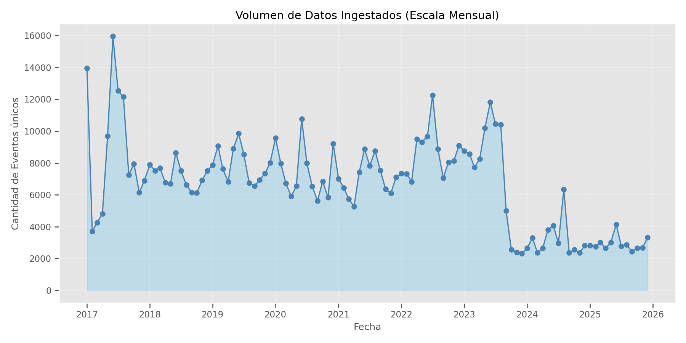
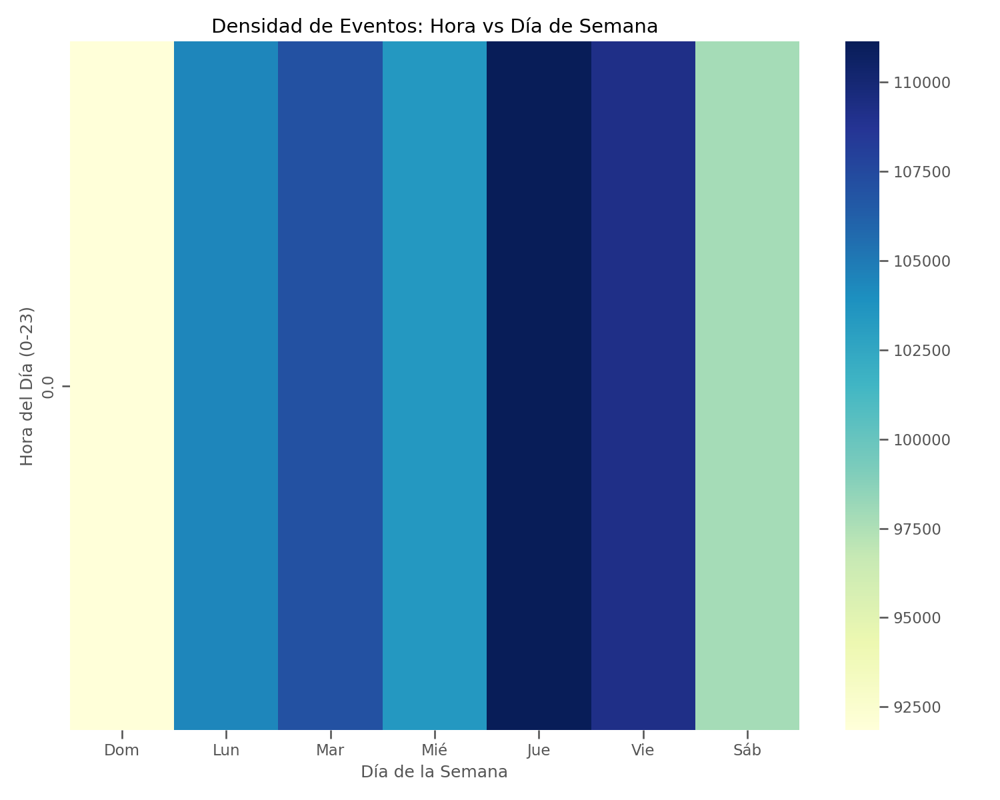

# Technical Report: Data Engineering and Methodology (Behind the Scenes)

**Project**: SEC Chile Interruption Monitor  
**Version**: 1.0 (January 2026)

---

## 1. Introduction: Data Architecture

This document details the underlying engineering that allowed for the construction of the 6.2 million record dataset used in the *Research Paper*. Unlike a static analysis, this project required the construction of an ETL (Extract, Transform, Load) infrastructure capable of reconstructing the history of electrical interruptions in Chile from "ephemeral traces" published by the regulator.

> [!TIP]
> For a more detailed narrative on project evolution and engineering challenges, consult the **[Technical Chronicle](technical_chronicle.md)**.

### 1.1 High-Level Diagram

---

## 2. Extraction Strategy (Scraping)

### 2.1 The Challenge: Ephemeral Data
The Superintendence of Electricity and Fuels (SEC) does not offer a downloadable history. It only shows a "snapshot" of the current system state every 10 minutes. If the data is not captured at that moment, it is lost forever.

### 2.2 Solution: Intelligent Polling
We implemented a *polling* system that queries the public API (`/api/v1/interrupciones`) at strategic intervals.
*   **Problem**: IP blocks and Cloudflare.
*   **Solution**: User-Agent rotation and *Exponential Backoff* handling to respect server limits.

---

## 3. Transformation and Cleaning (Data Engineering)

### 3.1 From Snapshot to Event
One of the greatest methodological challenges was defining **"What is an outage?"**.
The API returns states: "At 14:00 there are 500 customers without power in Maipú." At 14:10 it says "300 customers."
*   **Methodological Decision**: We cannot know if the 200 who returned are the same as the original 200 without a unique ticket ID.
*   **Hashing Logic**: We generate a unique `hash_id` based on the tuple `(Commune, Company, Date, Start_Time, Affected_Customers)`. This allows us to identify a specific event over multiple snapshots without duplicating final statistics.

---

## 4. Storage and Modeling (PostgreSQL)

We use a **Star Schema** optimized for analytical queries (OLAP):
*   **Fact Table**: `fact_interrupciones` (6.2M rows).
*   **Dimensions**: `dim_geografia`, `dim_empresa`, `dim_tiempo`.

This design allows for spatial aggregations (Heatmaps) and temporal aggregations (Time Series) in milliseconds, facilitating the generation of paper graphics.

---

## 5. Pipeline Visualization (Descriptive)

To ensure process integrity, we monitor two key metrics: *Ingestion Volume* and *Temporal Consistency*.

*Figure T1: Volume of records processed per month. Consistency in historical capture since 2017 is observed.*

*Figure T2: Coverage Heatmap (Hour vs Day). Uniform distribution indicates that the scraper operates 24/7 without significant "blind spots," validating the continuous polling strategy.*

---

## 6. Architecture: "Hybrid Medallion" (Local-First)

To solve cost and scale challenges, we implemented a **Hybrid Medallion Architecture**. This pattern decouples heavy processing (Local) from light consumption (Cloud):

1.  **Bronze Layer (Local - Raw)**:
    *   *Data*: Raw `Snapshot JSON` from the scraper.
    *   *Volume*: ~100 GBs of temporary files.
    *   *Location*: Local Disk (Edge).

2.  **Silver Layer (Local - Clean)**:
    *   *Data*: `fact_interrupciones` in PostgreSQL. Deduplicated, clean, and enriched data.
    *   *Process*: MD5 Hashing for uniqueness.
    *   *Location*: Local PostgreSQL.

3.  **Gold Layer (Cloud - Business)**:
    *   *Data*: `dashboard_stats` in Supabase.
    *   *Definition*: Aggregated metrics ready for the Dashboard (KPIs, pre-calculated Time Series).
    *   *Advantage*: We upload only ~10MBs of "intelligence" instead of 6GB of "history," avoiding *Request Units* costs and latency.

---

## 7. Key Data Dictionary

### Fact Table: `fact_interrupciones`
The heart of the system. Each row is a "snapshot" of an outage at a given time.

| Field | Type | Description |
| :--- | :--- | :--- |
| `hash_id` | PK (MD5) | `MD5(Commune + Company + Date + Time + Affected)`. Deduplication key. |
| `id_tiempo` | FK (Int) | Link to `dim_tiempo`. Format `YYYYMMDD`. |
| `id_geografia`| FK (Int) | Link to `dim_geografia` (Region/Commune). |
| `clientes_afectados`| Int | Number of reported customers without service. |
| `hora_interrupcion` | Time | Declared start time of the outage. |

### Main Dimensions
*   **`dim_geografia`**: Normalizes commune names (e.g., "Valparaiso" -> "VALPARAISO").
*   **`dim_empresa`**: Unifies business names (e.g., "CGE DISTRIBUCION" -> "CGE").
*   **`dim_tiempo`**: Allows temporal hierarchies (Year > Quarter > Month > Day).
